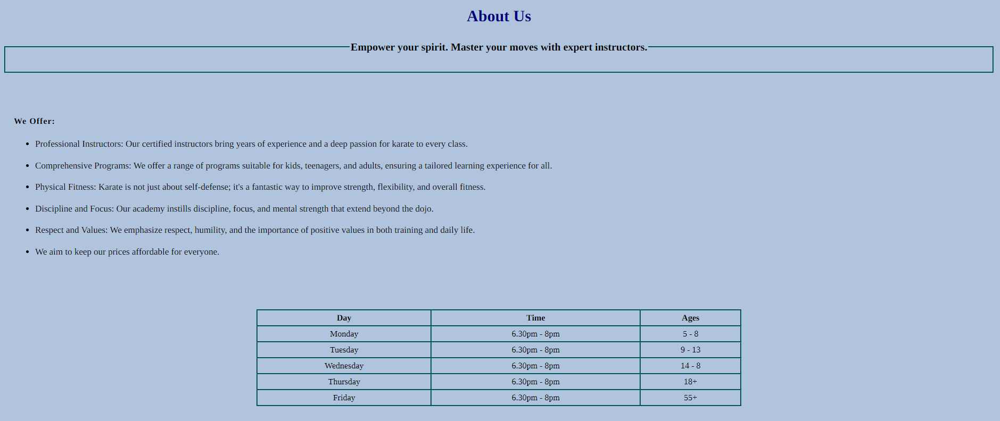

# Karate Academy

Karate Academy is a website desing to privide information about Martial Arts Academy that offers
 begginers friendly classes for people of all ages. This project aims to present the academy features, classes and contact information for potential student.

## Features

---

### **_Navigation_**

The navigation bar is design to enhace user experience by providing ease access to different sections of the website. It includes the following features:

* **Karate Academy:** Clicking on the logo, takes you will be directed to the header section whre you can view the Karate Academy image and name.
* **About Us:** Users can learn about the academy's background, philospohy and offerings by clicking on this link.
* **Sign Up:** This link direct users to sign-up section, where they can easily register for classes.
* **Contact:** Users can quickly find all the needed information by clicking on this link, making it convienient to reach out for inquiries.

The navigation section ensures that users can explore the website's content effortlessly and engage with the academy's services.

---

### **_The Header_**

* The "Header" section of the Karate Academy website is a captivating introduction to the site's content.
* It features an engaging image that visually represent the spirit of karate practice.
* Accompanied by the academy's name and a compelling tagline, the header immediately communicates its purpose and values.
* This carefully designed header establishes a strong connection with visitors and sets the tone for their exploration of the website.

---

### **_The About Us Section_**

* The "About Us" section provides a concise overview of the Karate Academy's mission and values.
* Through a well structured layout, it itroduces visitors to the academy's commitment to empowering individuals of all ages through karate training.

### **_The Sign Up Form_**

* The "Sign Up Form" provides users with a convenient way to register to karate classes.
* Featuring a user-friendly design, the form captures essential details such as first name, last name and email address, enhancing the academy's enrollment process.

---

### **_The Contact Section_**

* The "Contact Section" offers users a direct means to connect with the Karate Academy team.
* With clear details presented in structured format, users can easily reach out for inquiries, bookings or any other informations needed.
* It displays essential contact information including phone number, email address and physical address.

---

## Testing

---

### **_Manual Testing:_**

* I tested navigation links to ensure that they lead to the corrext section.
* I tested that this webpage works in different browsers.
* I checked responsiveness on various devices to ensure consistent user experience.
* I have confirmed that the form works: requires entry in the every field, will only accept an email in email field and the submit button works.

### **_Bugs:_**

* I resolved alligment issues in the header and footer sections
* I fixed error i had in my index.html file (which was only a typo)

### **_W3C Validation:_**

* Validated HTML and CSS files using W3C validators to ensure compliance with web standards.

### **_Accessibility:_**

* I checked accessibility using Lighthouse to ensure the site meets accessibility standards.
